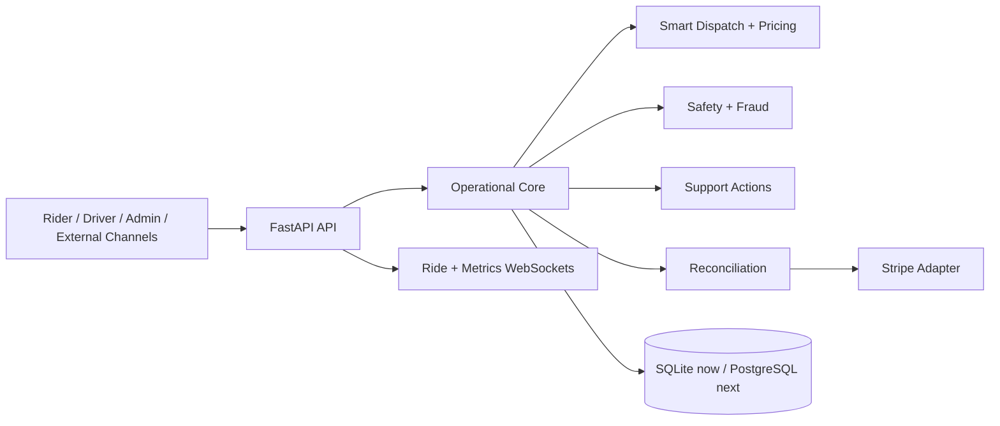

# MyRide Autonomous Mobility Ecosystem

MyRide v2 is a runnable vertical slice of an AI-operated ride ecosystem. One FastAPI service currently owns the domain transaction so dispatch, safety, ride state, support, and reconciliation remain consistent. Its boundaries are designed to split into services when load or team ownership requires it.

## Run locally

```powershell
python -m pip install -r requirements.txt
python run.py
```

Open:

- Rider: http://localhost:8000/rider
- Driver: http://localhost:8000/driver
- AI operations: http://localhost:8000/admin
- OpenAPI: http://localhost:8000/docs

Docker users can copy `.env.example` to `.env` and run `docker compose up --build`.

## Render preview

`render.yaml` deploys the complete local experience as a free Render preview. It keeps development demo sessions enabled so Rider, Driver, and AI Ops remain usable without distributing passwords. The free service uses ephemeral SQLite storage and may reset data after a restart. For a production deployment, set `ENVIRONMENT=production`, configure role credentials and provider secrets, and attach a persistent disk or migrate the repository to managed PostgreSQL.

## Implemented now

- Persistent SQLite ride, driver, support, event, and reconciliation records
- Multi-factor driver ranking using proximity, rating, acceptance, and safety
- Demand, traffic, vehicle, distance, and duration fare calculation
- Safety and pre-transaction fraud scores on every booking
- Validated ride lifecycle with automatic payment finalization and 85/15 payout split
- Passenger booking and tracking surface with live Johannesburg map
- Driver workspace with trip progression, earnings, safety, and AI insights
- AI operations dashboard with fleet map, ledger, service health, and WebSocket metrics
- Autonomous support for cancellations, lost items, fare reviews, and safety escalation
- Stripe live mode when configured and deterministic development fallback otherwise
- Health, readiness, versioned REST, compatibility routes, and WebSocket streams
- HMAC-signed, expiring passenger/driver/admin sessions with object-level ownership checks
- Per-client API throttling with stricter login limits and standard retry headers
- Durable security audit events with a protected AI Ops activity feed
- Idempotent Stripe webhook ingestion with persisted provider event IDs

## Identity and payments

Development mode provides short-lived demo sessions for the three local product surfaces. Set `ENVIRONMENT=production`, replace `MYRIDE_AUTH_SECRET` with at least 32 random characters, and configure all role passwords before deployment; production disables the demo-session route.

Admin and driver APIs enforce both role and resource ownership. WebSockets require the same signed token in their connection query. Stripe webhook events are signature-verified when `STRIPE_WEBHOOK_SECRET` is configured and recorded once by provider event ID so retries cannot duplicate financial effects.

## Architecture boundary



SQLite is intentional for the runnable local slice. Before multi-instance production deployment, replace the repository connection with PostgreSQL/PostGIS, publish domain events through Kafka or Redis, move rate limiting to a shared store, and move long-running provider work to workers. Kubernetes, Istio, multi-region failover, trained ML models, Twilio phone numbers, emergency-service integrations, and real Stripe payouts require external infrastructure, credentials, legal review, and operational testing; they are not represented as complete merely by configuration stubs.

## Tests

```powershell
python -m unittest discover -s tests -v
```

The suite covers token signing and expiry, role rejection, rate-limit isolation and recovery, durable audit ordering, fare factors, deterministic dispatch, lifecycle constraints, payout reconciliation, webhook replay protection, standard support resolution, and safety escalation.