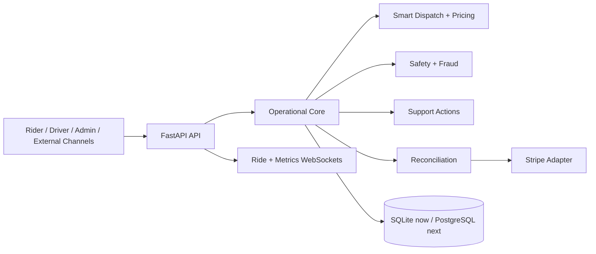

<<<<<<< HEAD
# MyRide Autonomous Mobility Ecosystem

MyRide v2 is a runnable vertical slice of an AI-operated ride ecosystem. One FastAPI service currently owns the domain transaction so dispatch, safety, ride state, support, and reconciliation remain consistent. Its boundaries are designed to split into services when load or team ownership requires it.

## Run locally

```powershell
python -m pip install -r requirements.txt
python run.py
```

Open:

- Rider: http://localhost:8000/rider
- Driver: http://localhost:8000/driver
- AI operations: http://localhost:8000/admin
- OpenAPI: http://localhost:8000/docs

Docker users can copy `.env.example` to `.env` and run `docker compose up --build`.

## Render preview

`render.yaml` deploys the complete local experience as a free Render preview. It keeps development demo sessions enabled so Rider, Driver, and AI Ops remain usable without distributing passwords. The free service uses ephemeral SQLite storage and may reset data after a restart. For a production deployment, set `ENVIRONMENT=production`, configure role credentials and provider secrets, and attach a persistent disk or migrate the repository to managed PostgreSQL.

## Implemented now

- Persistent SQLite ride, driver, support, event, and reconciliation records
- Multi-factor driver ranking using proximity, rating, acceptance, and safety
- Demand, traffic, vehicle, distance, and duration fare calculation
- Safety and pre-transaction fraud scores on every booking
- Validated ride lifecycle with automatic payment finalization and 85/15 payout split
- Passenger booking and tracking surface with live Johannesburg map
- Driver workspace with trip progression, earnings, safety, and AI insights
- AI operations dashboard with fleet map, ledger, service health, and WebSocket metrics
- Autonomous support for cancellations, lost items, fare reviews, and safety escalation
- Stripe live mode when configured and deterministic development fallback otherwise
- Health, readiness, versioned REST, compatibility routes, and WebSocket streams
- HMAC-signed, expiring passenger/driver/admin sessions with object-level ownership checks
- Per-client API throttling with stricter login limits and standard retry headers
- Durable security audit events with a protected AI Ops activity feed
- Idempotent Stripe webhook ingestion with persisted provider event IDs

## Identity and payments

Development mode provides short-lived demo sessions for the three local product surfaces. Set `ENVIRONMENT=production`, replace `MYRIDE_AUTH_SECRET` with at least 32 random characters, and configure all role passwords before deployment; production disables the demo-session route.

Admin and driver APIs enforce both role and resource ownership. WebSockets require the same signed token in their connection query. Stripe webhook events are signature-verified when `STRIPE_WEBHOOK_SECRET` is configured and recorded once by provider event ID so retries cannot duplicate financial effects.

## Architecture boundary



SQLite is intentional for the runnable local slice. Before multi-instance production deployment, replace the repository connection with PostgreSQL/PostGIS, publish domain events through Kafka or Redis, move rate limiting to a shared store, and move long-running provider work to workers. Kubernetes, Istio, multi-region failover, trained ML models, Twilio phone numbers, emergency-service integrations, and real Stripe payouts require external infrastructure, credentials, legal review, and operational testing; they are not represented as complete merely by configuration stubs.

## Tests

```powershell
python -m unittest discover -s tests -v
```

The suite covers token signing and expiry, role rejection, rate-limit isolation and recovery, durable audit ordering, fare factors, deterministic dispatch, lifecycle constraints, payout reconciliation, webhook replay protection, standard support resolution, and safety escalation.
=======
# My Ride

Single-site e‑hailing demo ecosystem (marketing + customer + driver + admin) built with:
- Express (ESM) + Socket.io
- SQLite (`better-sqlite3`)
- JWT auth
- Stripe Checkout + webhook (test mode)

## Local development

1. Install dependencies:

```bash
npm install
```

2. Create your env file:
- Copy `.env.example` → `.env`
- Set `JWT_SECRET` to a long random string

3. Start dev server:

```bash
npm run dev
```

App runs on `http://localhost:3000`.

## Deploy to Render

**Full checklists (A / B / C):**
- Legacy Node env → [docs/RENDER_LEGACY.md](./docs/RENDER_LEGACY.md)
- Path A FastAPI → [ecosystem/docs/RENDER_ECOSYSTEM.md](./ecosystem/docs/RENDER_ECOSYSTEM.md)
- Go-live cutover → [ecosystem/docs/CUTOVER.md](./ecosystem/docs/CUTOVER.md)
- Blueprint → root [`render.yaml`](./render.yaml) (`my-ride` + `my-ride-ecosystem` + Postgres + Redis)

### Quick checklist (legacy Node)

### Service type
- Use a **Web Service** running Node.js.

### Start command
- Recommended: `npm start`

### Environment variables (minimum)
- **Server**
  - `NODE_ENV=production`
  - `HOST=0.0.0.0`
  - `PORT` (Render provides this automatically; your app should respect it)
  - `APP_ORIGINS` (optional on Render: the server also allows `RENDER_EXTERNAL_URL`, which Render sets automatically)
  - `EXTRA_APP_ORIGINS` (optional: comma-separated extra origins, e.g. `https://www.example.com` while you also use the `onrender.com` URL)
  - `HELMET_DISABLE_CSP=1` (emergency only: turns off **Content-Security-Policy** but keeps other Helmet headers; see `backend/securityHeaders.js`)
- **Auth**
  - `JWT_SECRET=<long random string>` (the included `render.yaml` uses `generateValue: true`)
  - `JWT_EXPIRES_IN=7d` (optional)
- **Database**
  - `SQLITE_PATH=/var/data/myride.sqlite` (recommended on a persistent disk; see note below)
- **Stripe (test mode)**
  - `STRIPE_SECRET_KEY=sk_test_...` (in production, `sk_test_` logs a **warning** unless `STRIPE_ALLOW_TEST_KEYS_IN_PRODUCTION=1`)
  - `STRIPE_WEBHOOK_SECRET=whsec_...` (create a **separate** endpoint + secret for test vs live in Stripe)
  - `STRIPE_SUCCESS_URL` / `STRIPE_CANCEL_URL` (optional on Render: defaults are derived from `RENDER_EXTERNAL_URL` when unset)

### Stripe webhook
Create a webhook endpoint in Stripe pointing to:
- `https://<your-app>.onrender.com/api/payments/webhook`

Copy the signing secret into `STRIPE_WEBHOOK_SECRET`.

### SQLite persistence warning (important)
Render web service filesystems are often **ephemeral**. If you keep `SQLITE_PATH` on the default filesystem, you may lose data on deploy/restart.

To persist data:
- Add a **Render Disk** (e.g. mounted at `/var/data`)
- Set `SQLITE_PATH=/var/data/myride.sqlite`

### Postgres vs SQLite (when to migrate)
- **SQLite** (as shipped) is fine for demos, a **single** web instance, and light traffic, especially with a **persistent disk** on Render.
- Move to **managed Postgres** (e.g. [Render Postgres](https://render.com/docs/postgresql) or Supabase) when you need **horizontal scaling** (multiple web instances), **higher write concurrency**, managed **backups/HA**, or you want to stop caring about disk mounts. That change requires a **dedicated project**: new data layer, migrations, and usually `pg` instead of `better-sqlite3`.

### `better-sqlite3` native module note
`better-sqlite3` is a native module and must be built against the Node version used in the deploy environment.
- This repo pins Node **20** via `.node-version` (see [Render Node version docs](https://render.com/docs/node-version)).

### Render Blueprint (`render.yaml`)
This repo includes a small [Render Blueprint](https://render.com/docs/infrastructure-as-code) for a **Web Service** with:
- `healthCheckPath: /api/health`
- **Starter plan + 1 GB disk** at `/var/data` (SQLite persists across deploys)
- `JWT_SECRET` generated by Render
- Stripe keys as `sync: false` (you paste them during the initial Blueprint setup)

For a **free** demo, edit `render.yaml`: set `plan: free`, remove the `disk:` block, and set `SQLITE_PATH` to `./myride.sqlite` (ephemeral filesystem).

## Repo hygiene
- `.env` is intentionally ignored by git (see `.gitignore`). Use `.env.example` for sharing config shape.
- Before every push or deploy, run:

```bash
npm run deploy:check
```

This fails the process if `.env` or `*.sqlite` files are **tracked by git**, and warns about weak `.gitignore` / placeholder `JWT_SECRET`.

### Content Security Policy (Helmet)
- In **production**, the server enables a **strict CSP** tuned for this app (Socket.io, Stripe, driver camera for QR). Source: `backend/securityHeaders.js`.
- In **development**, CSP is **off** so local iteration is easy.
- If a third-party or browser quirk breaks the UI, set `HELMET_DISABLE_CSP=1` on the server, redeploy, then fix the policy (or file an issue) — do not leave this on permanently if you can avoid it.

### Pre-deploy verification (recommended)
- **Run `npm run deploy:check`** in CI or locally after `git add`.
- **Smoke test on Render URL**: open the site, register/login, request a ride path, confirm Socket.io connects (watch browser devtools network). If the page is blank, check the console for CSP blocks first, then try `HELMET_DISABLE_CSP=1` to confirm.
- **Stripe**: Dashboard webhook targets `https://<your-service>/api/payments/webhook` and events include at least `checkout.session.completed` and `payment_intent.payment_failed` (match your `payments.js` handlers). Use a **test** secret in `STRIPE_WEBHOOK_SECRET` until you go live.
- **CORS / origins**: `RENDER_EXTERNAL_URL` is merged automatically. For **extra** hostnames (e.g. `www` + apex, or a transition period), add them to `EXTRA_APP_ORIGINS` or `APP_ORIGINS`. If Stripe or your host uses a custom primary domain, confirm in Render’s dashboard that the public URL you expect is still allowed.
- **Admin account**: change the bootstrapped admin password after first login; avoid leaving demo credentials in production env.
- **Logicline / driver mock**: `mock-confirm` is off in production unless `ALLOW_MOCK_LOGICLINE=1` (see `driverAuth` routes).
- **Observability**: use Render logs for errors; add an external monitor (UptimeRobot, etc.) pinging `/api/health` if you want alerts.

### Secrets and key rotation
- If a key ever leaked (committed to git, pasted in a ticket, screenshot), **rotate** it in the provider and update Render env: **`JWT_SECRET`** (invalidates all sessions), **`STRIPE_SECRET_KEY`**, **`STRIPE_WEBHOOK_SECRET`** (must match the webhook endpoint in Stripe).
- Keep **test** (`sk_test_` / test webhook secret) and **live** (`sk_live_` / live webhook secret) in separate Render services or environments when possible.

## My Ride — Full e-hailing web ecosystem (one website)

This repo runs **one web app** at `http://localhost:3000` with:
- Public marketing site (guest)
- Customer web app (role = `customer`)
- Driver web app (role = `driver`)
- Admin back office (role = `admin`)
- One shared backend API + SQLite DB
- Real-time simulation via WebSockets (Socket.io) + polling fallback
- Stripe Checkout payment (test mode) required to complete ride

---

## Prerequisites

- Node.js 18+ (recommended 20+)
- A Stripe account (test mode keys) for payment flow

---

## Run locally

From the repo root:

```bash
npm install
cp .env.example .env
npm run db:init
npm run seed:drivers
npm run dev
```

Open:
- `http://localhost:3000`

---

## Admin login (auto-bootstrap)

On boot, the server will create an admin user **if** these are set in `.env`:
- `ADMIN_EMAIL`
- `ADMIN_PASSWORD`
- `ADMIN_NAME`

Defaults (from `.env.example`):
- Email: `admin@myride.local` (match your `.env`)
- Password: `Admin12345!`

---

## End-to-end test (customer → driver → payment → complete)

### 1) Admin (approve drivers optional)

- Go to `#/admin`
- Login with admin credentials above
- (Optional) Click **Seed 8 Drivers**
- Click **Refresh Drivers** and confirm drivers exist and are `approved`

### 2) Driver (go online)

- Go to `#/driver`
- Login as a seeded driver:
  - Seeded password: `Driver12345!`
  - Seeded emails are random — easiest way is Admin → Refresh Drivers and copy a driver email.
- Click **Update Location (mock)**
- Click **Go Online**

### 3) Customer (request ride)

- Go to `#/customer`
- Register a customer account
- Fill pickup/dropoff + choose vehicle type
- Click **Request Ride**
- Matching is mock: nearest online approved driver of same vehicle type.

### 4) Driver (accept + start)

- Driver receives the request in “Incoming Requests”
- Click **Accept**
- Click **Start Ride**
- Click **End Ride → Request Payment**

### 5) Customer (pay with Stripe test)

- Customer sees payment status `requires_payment`
- Click **Pay with Stripe (test)**
- Use test card:
  - `4242 4242 4242 4242` (any future expiry, any CVC, any ZIP)

### 6) Driver (complete)

- After webhook confirms `paid`, driver can click **Complete (requires paid)**

---

## Stripe setup (test mode)

In Stripe Dashboard (Test mode):
1. Get API key (Developers → API keys)
   - Set `STRIPE_SECRET_KEY`
2. Create webhook endpoint:
   - URL: `http://localhost:3000/api/payments/webhook`
   - Events: `checkout.session.completed`, `payment_intent.payment_failed`
   - Set `STRIPE_WEBHOOK_SECRET`

Restart server after changing `.env`.

Local webhook forwarding (recommended):

```bash
stripe listen --forward-to localhost:3000/api/payments/webhook
```

Copy the `whsec_...` printed by Stripe CLI into `.env` as `STRIPE_WEBHOOK_SECRET`.

---

## Deploy to Render (summary)

- Web service build: `npm install`
- Start: `npm start`
- Env vars:
  - `NODE_ENV=production`
  - `APP_ORIGINS=https://<your-render-url>` (optional if `RENDER_EXTERNAL_URL` is enough for your setup)
  - `JWT_SECRET=...`
  - `SQLITE_PATH=./mycab.sqlite`
  - `ADMIN_EMAIL`, `ADMIN_PASSWORD`, `ADMIN_NAME`
  - `STRIPE_SECRET_KEY`, `STRIPE_WEBHOOK_SECRET`
  - `STRIPE_SUCCESS_URL=https://<render-url>/#/customer?paid=1`
  - `STRIPE_CANCEL_URL=https://<render-url>/#/customer?paid=0`

Stripe webhook on Render:
- `https://<render-url>/api/payments/webhook`

>>>>>>> origin/master
